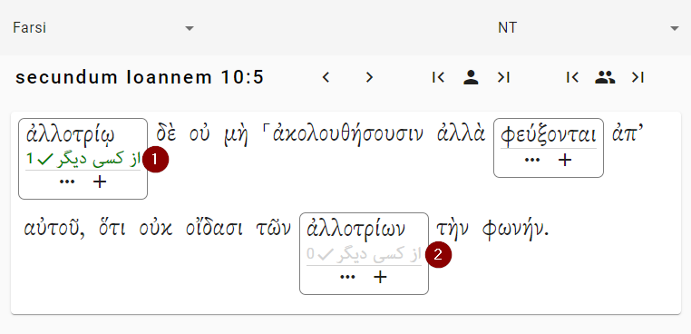

# Glosses
Most of your work will be defining words for the glosses. When you look at a verse, you see something like this:

The words that have boxes around them need glosses. The other words do not need glosses. (They are above the frequency threshold for the project, so there is no need to define them.) To add a gloss, you can click on the two marked buttons:

1. Click this button to open a menu showing you all of the possible types of glosses. (See below.)
2. Click this button to create a simple gloss — a gloss that just gives a definition.

(Depending whether your language is right-to-left or left-to-right, the order of these buttons will be different.)

Suppose you click on the “+” button. Then a dialog like this opens up. This is shown in the next step.

## Adding a gloss

1. “Gloss” — Here is where you type the gloss.
2. “Add Gloss”  — Click this button to add the gloss.
3. “Dismiss” — Click this button to get out the dialog box (and lose your work).

Suppose you've entered that text, and you click on the “Add Gloss” button.

## Voting for glosses
Tip: See [Glosses & Votes](glosses-votes.md) to learn about how glosses and votes work.

Once you add a gloss for a word, that gloss is automatically suggested in other places where that work occurs. The picture below shows the screen after we added the gloss, as in the previous section.

1. We clicked the button to add the gloss to this word. Now the gloss has been added. Notice: 1) The gloss is shown in green, because that is the one we chose. 2) The number “1” shows that this gloss has one vote so far.
2. We haven't done anything this word. But because “ἀλλοτρίῳ” and “ἀλλοτρίων” come from the same word (ἀλλότριος), the gloss is now available for you to vote. Just click on it to vote for it.

After we click on number 2 above, both words have votes:

1. This word now has a gloss and a vote.

## Types of Glosses
There are four types of glosses. Mostly you will use simple glosses (the “+” button). If you are new to this, you don't need to worry about the others.

### Simple Gloss
A simple gloss is just the definition of a word. This is usually what you want. (In the PDF version, it will probably also show the parsing, but you don't need to worry about that.)

Remember that the system will automatically show the parsing, so you just need to enter the meaning of the word.

As an example, in [the English version of Matthew 1:1](https://openreadersbibles.github.io/pub-sblgnt-biblebento/default/sblgnt-biblebento_NT_MAT-1.html), the note for the word “Βίβλος” looks like this:

> NNFS βίβλος *book*

A user would just have to enter “book” here: the system will put in the parsing and the lexical form of the word.

### Simple Gloss & Note
If you want to add an explanation *along with* your gloss, you may make a “Gloss & Note.” For instance, maybe you want to say, “The meaning of this word is uncertain.” 

Staying with the previous example of [Matthew 1:1](https://openreadersbibles.github.io/pub-sblgnt-biblebento/default/sblgnt-biblebento_NT_MAT-1.html), if you added a “Simple Gloss & Note” it would look like this:

> NNFS βίβλος *book*. Probably it was a scroll rather than a codex.

In this case, the user has written out “book” for the gloss, and “Probably it was a scroll rather than a codex.” for the note.

Here it what the screen looks like:

1. “Gloss” — This is the gloss, just like a simple gloss.
2. “Markdown” — Here is where you put your note. The note can include some markdown, which is described here [here](markdown.md).
3. This shows what your note will look like.

### Freeform Gloss
This is like a “Gloss & Note” but without the gloss. If for some reason you don't want to give a gloss, you can use this option.

### Empty Gloss
If you add an empty gloss, no footnote will be given for the word at all: no parsing, no lexical form, no gloss.

Usually this will not be the correct thing to do. You may wish to create an empty gloss if you are explaining the a phrase with a phrase gloss.

Why would you add an empty gloss? If you leave a word without a gloss, the website will give you a warning because it will think you have forgotten to gloss the word. If you tell it you want an empty gloss, it knows you made the decision on purpose and will not give the warning.

## Phrase Glosses
Sometimes it is helpful to add a gloss for a group of words. For instance, the combination of several words can have a meaning that is not predictable from the individual words. To add a phrase gloss, click the “Add a phrase gloss...” button at the bottom of the verse. Here is what you will see:

1. Click on the words to select your phrase. (All the words have to be in a row.) Click a word to select it or deselect it. If you get lost...
2. “Clear selection” — This will clear your selected words.
3. “Enter plain text or markdown” — Here you enter in your note. [Markdown](markdown.md) is supported.
4. “Add Gloss” — Click here to add the phrase gloss.

After the phrase gloss is added, it is displayed under the verse.

1. This shows the source text phrase.
2. This shows the gloss. (If there is more than one gloss, you can vote, just as with a regular gloss.)

