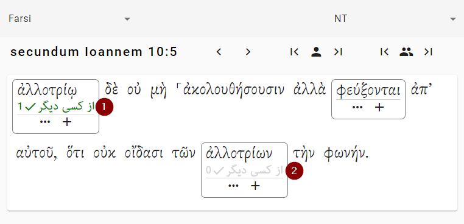

# Glosses & Votes
Your goal is to find the best gloss for each word. One word may have several possible glosses. You want to pick the gloss that makes the most sense in the context of the verse. (See [Good glosses](good-glosses.md) for more on the theory of that.) 

Each user can cast a vote for the gloss he or she thinks is best. Whichever gloss has the most votes is the gloss that will be used.

(A gloss is usually just the definition of a word. For alternatives to this, see [Glosses](gloss-types.md).)

When you add a gloss to a word, that gloss will automatically be suggested for other instances of that word.

1. This is the gloss that the user actually typed in.
2. This gloss has been suggested automatically because “ἀλλοτρίῳ” and “ἀλλοτρίων” come from the same word (ἀλλότριος).

But remember, the suggestion may not be correct. For instance, “λόγος” might mean “word” in one verse, but “report” in another verse. That is why you have to vote for each word separately. The website makes it as easy as possible for you, but no easier.

## If there is just one person in your project
If you are working alone, then “voting” for a gloss just means approving it. It just means, “Yes, I looked at this word, and this gloss is appropriate.” That's all.

## If there are multiple people in your project
If there are multiple people in your project, you can vote among yourselves to choose the best gloss.

For some languages, perhaps lots of different people will work on a project. The website allows that kind of collaboration through the voting system.

Whichever gloss has the higher number of votes is the gloss that will be used in the publication.

## Advanced: Editing and deleting glosses
It is possible to edit and delete glosses. When you edit a gloss, it changes the gloss *everywhere* in the project. For example, if you change the gloss for אֱלֹהִים in Genesis 1:1, it will also be changed in Malachi 3:18. If you delete the gloss for אֱלֹהִים in Genesis 1:1, it will be deleted *everywhere* in the project. You can delete it and then add it back again — but you will have to go to every other occurence and vote for it. This can be a dangerous thing to do, so you need to do an extra step to enable it (see the box below).

You must be a project admin to make a user a power user. Even if you are the admin you have to specifically make yourself a power users.

!!! tip "How to make yourself a power user"    
    1. Go to your project's “Settings” 
    2. Go to the “Project Members” tab.
    3. Use the toggle to amke yourself a “power user” 
    4. Click the “Save Changes” button.
    
    Back in the worksapce, you will get a little edit icon next to each gloss.
