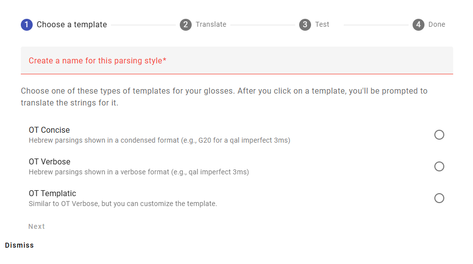
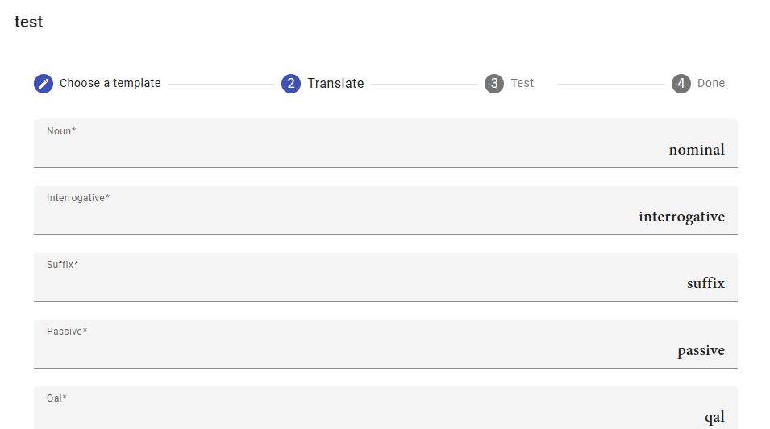
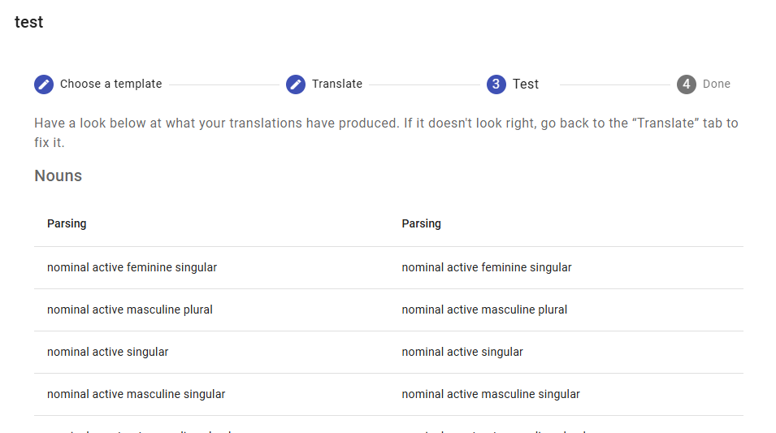
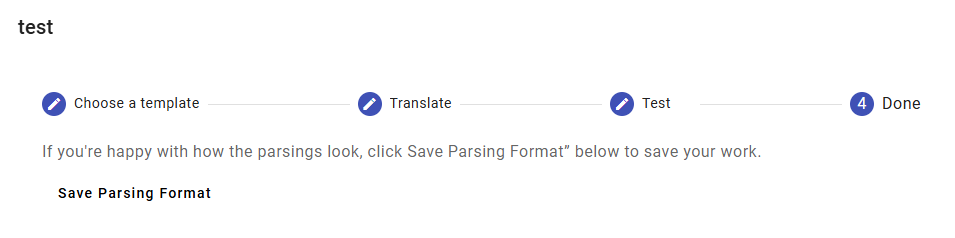

# Project Settings
## Parsing Formats
Aside from providing glosses for the words, you need to set up a format for the grammatical parsings. Remember that most of the work is already done: we already have the Greek and Hebrew words parsed! You just need to provide translations for the Greek and Hebrew grammatical terms (e.g., indicative, nominative, qal, piel).

This doesn't have to be set at the beginning of the project. You can enter the glosses without doing it. You just need to do it before you actually publish.

## Step By Step
This section goes through the process of setting up a parsing format step-by-step. We'll come back to the idea of “parsing format templates” in the next section.

To set up the parsing format for your project, go to the “Parsing Formats” section of project settings. For each canon in your project (e.g., NT, OT), you will need at least one parsing format. Click the “Add Format...” button in the relevant section. 

The first step is to type in a name for your format—it can be anything, so long as it's unique. Then you can select the parsing format template you want to use. We'll discuss this choice more in the next section. For this example, we've called the parsing format “test” and we've chosen the “OT Verbose” template. Then click “Next.”

The next step is to translate all of the terms: nominative, interrogative, suffix, passive, and so forth. You can see that the English names are filled in for you already. Once you've translated all of the strings, click “Next.”

Now you see a list of all of the possible parsings, for nouns and verbs. You can review this list to see if your parsings display correctly. (Typically the left column will have the English parsing, and your parsing will be shown in the right column. In this example we didn't take the trouble to enter in the grammatical terms for a different language.) There are lists for noun forms and verb forms. If you need to revise, click “Back.” If you are satisfied, click “Next.”

The final step is just to save your parsing.

## Parsing Format Templates
Parsings can be shown in different ways. We have three different types of parsings for each canon: verbose, concise, and templatic. Verbose parsing formats write out the parsing in long form. They are easy for beginners to read, but they will make the book longer. Concise parsing formats use abbreviations and numbers to express the full parsing in just a few characters. They are harder to read, but they make the book shorter (and are perhaps easier for experienced readers to use). A templatic format lets you customize the appearance of the parsing.

For the Old Testament:

- OT Verbose: These parsings use lots of words. E.g., qal imperfect 3ms
- OT Concise: These parsings use abbreviations and numbers. E.g., G20
- OT Templatic: This is for people who need to customize the appearance of their parsing more completely.

For the New Testament:

- NT Verbose: These parsings use lots of words. E.g., present active indicative 3s
- NT Concise: These parsings use abbreviations and numbers. E.g., V3SAPI
- NT Templatic: This is for people who need to customize the appearance of their parsing more completely.

### Verbose Formats

#### Old Testament
In the OT Verbose Format, you get the following format for nouns and verbs. You decide whether to use full words (e.g., active) or abbreviations (e.g., act).

| Word Type | Format | Example |
|-------------|-------------|---------|
| Nouns  | *noun state gender number* | noun active masculine singular |
| Verbs | *stem tense person gender number* | qal imperfect 3rd fem sg |

Any Hebrew word can be preceded by an interrogative, or followed by a pronominal suffix. These are shown as follows:

| Word Type | Format | Example |
|-------------|-------------|---------|
| Interrogative | *, interrogative* | noun active masculine singular, interrog |
| Pronominal Suffix | *, pronominial suffix person gender number* | qal imperfect 3rd fem sg, pron suff 2nd masc sg |

#### New Testament
The NT Verbose Format produces parsings that look like the following. You decide whether to use full words (e.g., present) or abbreviations (e.g., pres).

| Word Type | Format | Example |
|-------------|-------------|---------|
| Nouns  | *case gender number* | nominative masculine singular |
| Finite Verbs | *tense voice mood person number* | aorist active indicative 3rd singular |
| Participles | *tense voice participle gender case number* | present active participle masculine nominative singular |
| Infinitives  | *tense voice infinitive*  | present active infinitive |

### Concise Formats

#### Old Testament
The OT Concise Format uses a system of abbreviations that is widely used in biblical studies. (It has been attributed to LaSor’s *Handbook of Biblical Hebrew*.) The BHS Reader's Edition provides [this chart](../images/bhs-readers-edition-insert.pdf) to summarize it. For this template, you only need to specify the correct abbreviations in your language.

### New Testament
The NT Concise Format is another sort of generally used format for abbreviating parsings.

| Word Type | Format | Example |
|-------------|-------------|---------|
| Nouns  | *N case gender number* | NAMS (i.e., noun accusative masculine singular) |
| Verbs | *V person number tense voice mood* | V3SAAI (i.e., verb 3rd singular aorist active indicative) |
| Participles | *VP tense voice case gender number* | VPPNMS (i.e., verb participle present passive nominative masculine singular) |
| Infinitives  | *VI tense voice*  | VIPA (i.e., verb infinitive present active) |

### Templatic Formats
If you would like finer grained control over your parsings, you can specify your own templates. This calls for a little technical skill: enough at least to think carefully about where spaces and such go in a template string.

The default templates produce the respective “verbose” parsing formats, so you can take those as a starting point. In the templates the string `__TENSE__` will be replaced by the string you provide for the tense (e.g., imperfect or impf). Note that each of these elements is two underscore characters, a label in all caps, and then two more underscore characters. You can rearrange the elements, add or remove spaces and punctuation between them, or omit any of them that you wish.

(If your language is right-to-left, it may be better to write out your template in a different place and then copy/paste it in.)

#### Old Testament
The noun and verb templates are the main ones. Then the pronominal suffix and interrogative templates are applied to any words that need them.

Note that there is no space between the `__NUMBER__` and the `__PRONOMINAL_SUFFIX_TEMPLATE__` elements. That is because the pronominal suffix template begins with a comma and a space.

| Word Type | Format | 
|-------------|-------------|
| Nouns  | `__NOUN__ __STATE__ __GENDER__ __NUMBER____PRONOMINAL_SUFFIX_TEMPLATE____INTERROGATIVE_TEMPLATE__` |
| Verbs | `__STEM__ __TENSE__ __PERSON__ __GENDER__ __NUMBER____PRONOMINAL_SUFFIX_TEMPLATE____INTERROGATIVE_TEMPLATE__` |
| Pronominal Suffix | `, __SUFFIX__ __PERSON__ __GENDER__ __NUMBER__` |
| Interrogative  | `, __INTERROGATIVE__` |

### New Testament

| Word Type | Format | 
|-------------|-------------|
| Nouns  | `__CASE__ __GENDER__ __NUMBER__` |
| Finite Verbs | `__TENSE__ __VOICE__ __MOOD__ __PERSON__ __NUMBER__` |
| Participles | `__TENSE__ __VOICE__ __PARTICIPLE__ __CASE__ __GENDER__ __NUMBER__` |
| Infinitives  | `__TENSE__ __VOICE__ __INFINITIVE__` |
