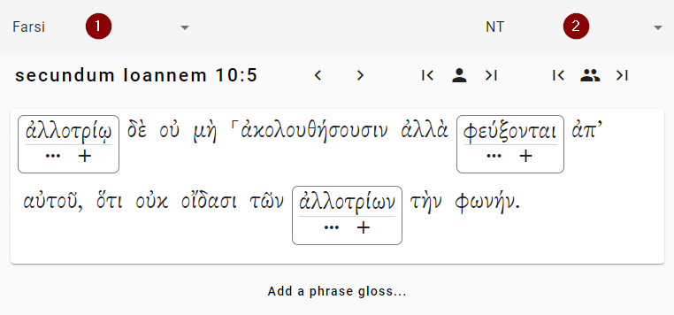
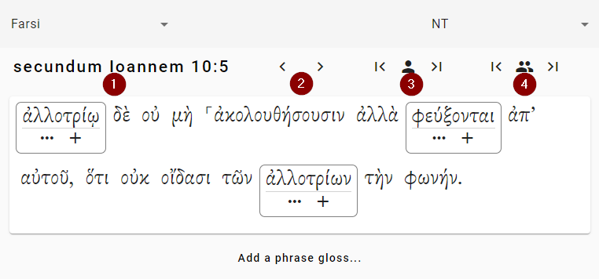

# The Workspace
The workspace is where you will do most of your work. You can look at different verses and add glosses to words.

How do you navigate around the workspace?

- Make sure you're looking at the correct project
- Make sure that you're looking at the correct canon
- Then you select the verse you want to work on

## Switching the Project or the Canon
Here's what the workspace looks like:

1. Click this drop-down to change the current project. In this example, the project “Farsi” is selected.
2. Click this drop-down to change the current canon. In this example, the canon is “NT.”

## Moving to another verse
Once you're in the correct project and canon, you want to select the correct verse. Here are the buttons you need:

1. If you click on the verse reference, a dialog box will open where you can select the book, chapter number, and verse number. (The verse reference may look different in your project, depending on the names of your books.) In this example, the verse selected is John 10:5.
2. Click these arrows to move one verse ahead or one verse back. In this example, this would move you to John 10:6 or John 10:4.
3. Click these buttons to skip ahead (or back) to the next verse that you need to vote on. This will skip over verses that don't need any glosses. It will also skip over verses where you have already voted on all of the glosses.
4. Click these buttons to skip ahead (or back) to the next verse that no one in the project has voted on. If you are working with other people this can help you find verses that no one has worked on yet.